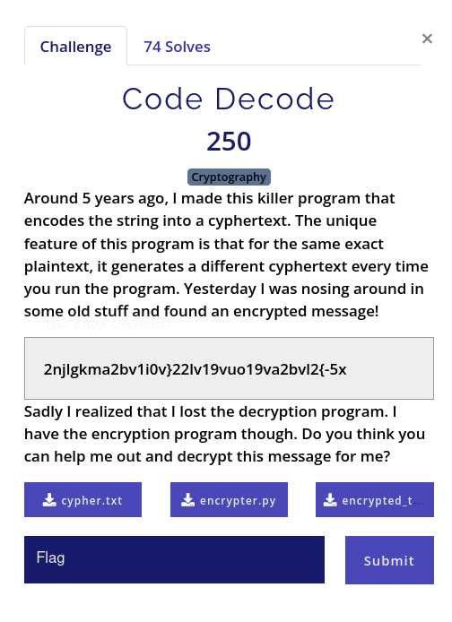

# Code Decode

## Statement



We were given [**`encrypted_text.txt`**](cypher.txt) file, which is supposed to be encrypted with a python script [**`encrypter.py`**](encrypter.py) using an encrption secret [**`cypher.txt`**](cypher.txt).

## Approach

These type of challenges are pretty typical. We analyze the encryption method and properly reverse them.

I written a script to grab [**`encrypted_text.txt`**](cypher.txt), [**`cypher.txt`**](cypher.txt) and reverse the encryption (decryption).

```python
def read_encryption_details(encrypt_key):
    with open("cypher.txt") as file:
        encrypt_text = eval(file.read())
        character_key = encrypt_text[encrypt_key]
    return character_key


def break_encryption(character_key):
    charstring = "abcdefghijklmnopqrstuvwxyz1234567890 _+{}-,.:"
    final_encryption = {}
    for i, j in zip(charstring, character_key):
        final_encryption[j] = i
    return final_encryption


def convert_cypher_to_plaintext(cypher_text, final_encryption):
    inputstring = ""
    for i in cypher_text:
        inputstring += final_encryption[i]
    return inputstring


def main():
    with open("encrypted_text.txt") as f:
        cypher_text = f.read()
    encrypt_key = cypher_text[:3] + cypher_text[-3:]
    cypher_text = cypher_text[3:-3]
    character_key = read_encryption_details(encrypt_key)
    final_encryption = break_encryption(character_key)
    print(
        f"Possible Flag = {convert_cypher_to_plaintext(cypher_text, final_encryption)}"
    )


if __name__ == "__main__":
    main()

```
