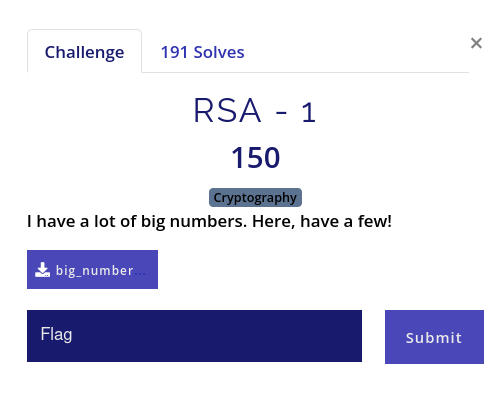

# RSA - 1

## Statement



Every beginner friendly CTF has atleast one challenge on RSA encryption period. This CTF has 3.

## Approach

I used [RsaCtfTool](https://github.com/Ganapati/RsaCtfTool). It contains some famous algorithms which tries to calculate `d` (inverse modulus of `e`) with less resources.

```bash
❯ ../tools/RsaCtfTool/RsaCtfTool.py -n 23519325203263800569051788832344215043304346715918641803 -e 71 --uncipher 10400286653072418349777706076384847966640064725838262071
private argument is not set, the private key will not be displayed, even if recovered.

[*] Testing key /tmp/tmprzhnd5ui.
[*] Performing mersenne_primes attack on /tmp/tmprzhnd5ui.
 24%|██████████████████████                                                                        | 12/51 [00:00<00:00, 316551.25it/s]
[*] Performing factordb attack on /tmp/tmprzhnd5ui.
[*] Attack success with factordb method !

Results for /tmp/tmprzhnd5ui:

Unciphered data :
HEX : 0x6473637b7430305f6d7563685f6d3474685f383839387d
INT (big endian) : 9621269132073872010525638902903988134500010392708266109
INT (little endian) : 11993657127041496499871362328745731192598296696556057444
utf-8 : dsc{t00_much_m4th_8898}
STR : b'dsc{t00_much_m4th_8898}'

```
