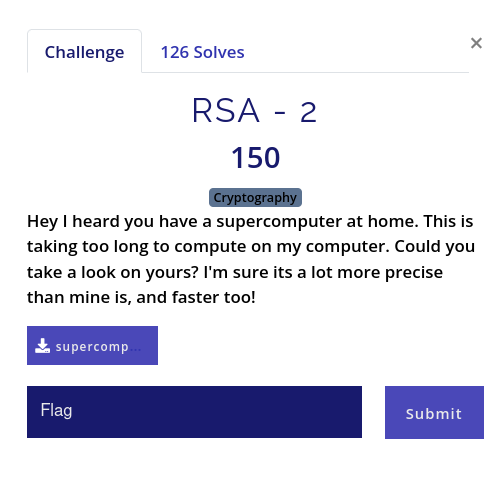

# RSA - 2

## Statement



This is not as obvious as `RSA - 1`. The numbers are somewhat big, but not as big as real encryption keys.

## Approach

Notice that, **`e`** is very small compared to **`c`** and **`n`**. With few minutes of googling, I found about Cube-Root attack. [ref 1](https://crypto.stackexchange.com/questions/33561/cube-root-attack-rsa-with-low-exponent), [ref 2](https://wiki.bi0s.in/crypto/rsa-cube-root-attack/)

As said in the above answer, I written a script. Computing cube root of that big **`n`** is not possible with python. Yes, Overflows exists in python too.

```python
def find_invpow(x, n):
    # Source: https://stackoverflow.com/q/55436001/12347371
    """Finds the integer component of the n'th root of x,
    an integer such that y ** n <= x < (y + 1) ** n.
    """
    high = 1
    while high ** n < x:
        high *= 2
    low = high // 2
    while low < high:
        mid = (low + high) // 2
        if low < mid and mid ** n < x:
            low = mid
        elif high > mid and mid ** n > x:
            high = mid
        else:
            return mid
    return mid + 1


def main(n, c, e):
    # Source: https://crypto.stackexchange.com/a/33571/96253
    # Assuming (p ^ e) < n
    for i in range(0, 1000):
        print(f"[+] Adding {i} * n...")
        m = c + (i * n)
        root = find_invpow(m, e)
        if pow(root, e) == m:
            hexifed = hex(root)[2:]
            decoded = bytearray.fromhex(hexifed).decode()
            print(f"Possible Flag = {decoded}")
            exit(0)
    print(f"[+] Not found for i < 1000")


if __name__ == "__main__":
    n = <copy paste n>
    c = <copy paste c>
    e = <copy paste e>
    main(n, c, e)

```
