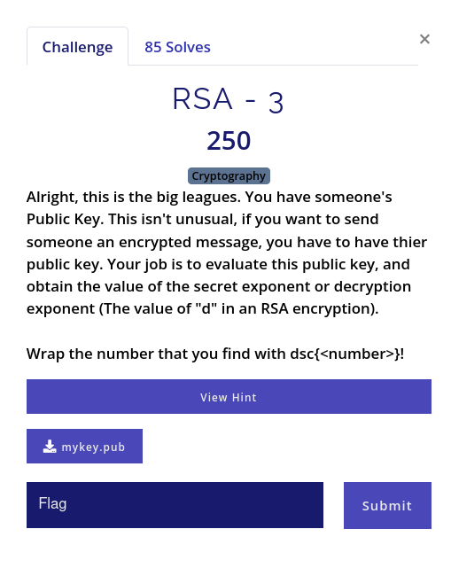
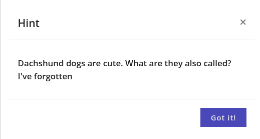

# RSA - 2

## Statement



This seems like the most difficult challenge on RSA's. Because the numbers of this key are pretty big. It's true, until we look at the hint.



## Approach

I took the hint. It costs 25 points. In the end, it was worth it.

Dachshund dogs are also called as wiener dog. There is an attack called owiener attack. I don't know the specifics of that, but I found a python package which solves this. I written a simple script to parse the Public key and get d from above mentioned package.

```python
from Crypto.PublicKey import RSA
import owiener


def main():
    with open("mykey.pub") as f:
        key = RSA.importKey(f.read())
    d = owiener.attack(key.e, key.n)
    if d is None:
        print("[-] owiener attack failed")
    else:
        print(f"Flag = dsc{{{d}}}")


if __name__ == "__main__":
    main()
```
